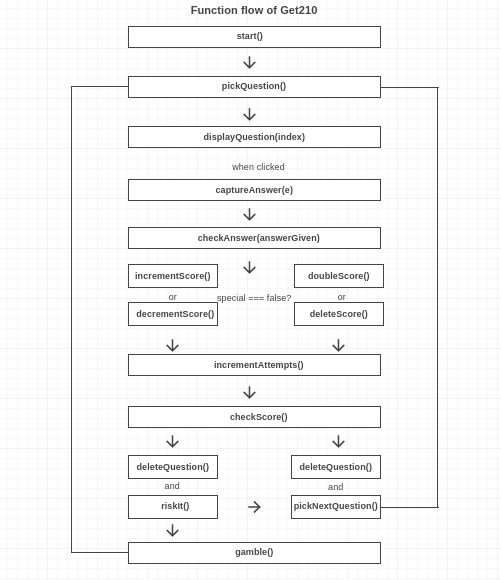
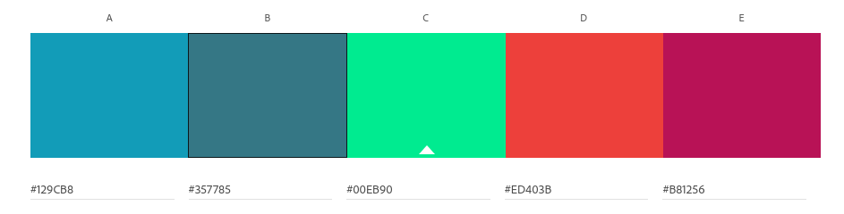
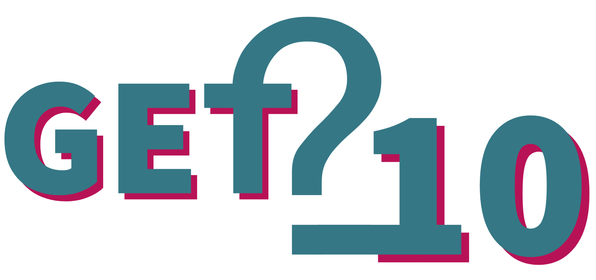
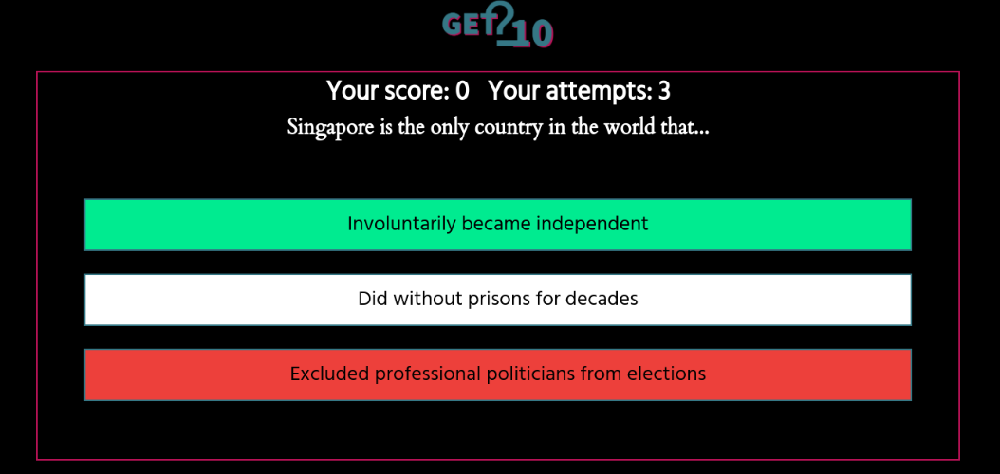
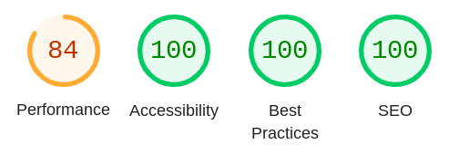

# Get210
## A quiz for everyone

[Click here for the full website access](https://thomasstrassmann.github.io/get-2-10/)

## Table of contents
1. [Introduction](#introduction) 
2. [Preparation - UX and UXD](#preparation)
3. [Features](#features)
4. [Testing](#testing)
5. [Deployment](#deployment) 
6. [Credits / attributes](#credits) 

## Introduction 
This quiz game tests the general knowledge of the users with really hard questions and thus presents a challenge for all passionate guessers. The goal of the game is to reach 10 correct answers with as few attempts as possible. Hence the name, Get210. 
The user always receives randomly asked questions from any subject area. If he answers correctly, he receives a point. If he answers incorrectly, he loses one. 
An exciting trick of the game is: After every fifth question, a player can play "all or nothing". If he answers correctly, he receives double the points. If he answers incorrectly, he loses all points and has to start over. So the minimum number of questions a player needs to reach the 10 points is 6 (5x 1 point, 1x 5 points).  
Sounds simple? Well, it depends on the questions.... 

## Preparation - UX and UXD
In terms of user experience, the focus should be on a varied challenge as well as fun. The users must not only score points with broad general knowledge, but also with a sure instinct as to when it makes sense to gamble and when it is better not to take any risks. The game is aimed at a wide audience. Anyone who likes quizzes should love this game.

The **UXD - User Experience Design** was declared and described in advance and includes the 5 panels *strategy, scope, structure, skeleton and surface*. 

### Strategy 
The game itself, as well as the questions, do not imply opinions, but only ask for knowledge. Therefore, it is intended for each person and is culturally appropriate. 

What makes this game special is the difficulty and whimsicality of the questions. No jokers help here, only your own brain. There is also a special feature that allows users to gamble for your score after every fifth question. 

To structure the content and make the data retrievable, there are different types, further explained in the scope section. 

What remains is the realization that the interface and the rules of the game should be self-explanatory for the user.

---
### Scope 
What is feasible? 

The question catalog is stored in an external JavaScript file. The catalog includes an array that contains objects (questions & answers), like so: 

let catalog = [
{question: “As of 2022, what is the most expensive painting in the world?”,

answers: [“Nu couché - Amedeo Modigliani”, “Les femmes d´Alger - Pablo Picasso”, “Salvator Mundi - Leonardo da Vinci”],

correct : 2

 },

{question: “...?”,

answers: [“...”, “...”, "...”],

correct : 0

 }]

This allows the game logic to access the correct data at any time. 

In terms of technology, HTML, CSS and two JavaScript files are used. One contains, as already formulated, the question catalog, the other the functions, in order to increase readability and maintainability of the code, as well as to separate the purposes. 

The required functions will look like this: 

start(){
 * gets called when the user clicks on start button.
 * hides the instructions page.
 * displays the gamearena.
 * calls the pickQuestion function.

}

pickQuestion(){
 * displays the question container.
 * gives all options a white background and black color.
 * genereates a random index from the catalog.
 * calls the displayQuestion function with the random index as an argument.

}

displayQuestion(index){
 * gets called everytime by the pickQuestion function with the questionIndex as an argument.
 * grabs the question and options from the random object in the catalog.
 * assigns them to the according places in the HTML file.
 * stores the question index in the attribute data-index.
 * creates an event listener for all options.

}

captureAnswer(e){
 * gets called when a user clicks an option.
 * captures the answer given by the user by catching the data-type attribute attached to the clicked event.
 * gives visual feedback with style change (option logged in).
 * calls checkAnswer function.

}

checkAnswer(answerGiven){
 * gets called by captureAnswer and receives the given answer as an argument.
 * first removes all click events from options to prevent multiple answers.
 * then grabs the current question index.
 * delays further action by 1.5 seconds for better UX and tension building.
 * it compares the given answer and correct answer from the catalog. 
 * checks if the global special variable is set to false. 
 * if set to false and answers match, the incrementScore function is called with the given answer as an argument.
 * if they do not match, the decrementScore function is called with the given answer as an argument.
 * if the special variable is true, it calls doubleScore instead of incrementScore and deleteScore instead of decrementScore.

}

incrementScore(){
 * gets called after a right answer is given and special is set to false.
 * increments the score by 1.
 * translates the data-type attribute to the correct answer id.
 * colors the correct answer for visual feedback.
 * calls incrementAttempts function.

}

decrementScore(){
 * gets called after a false answer is given and special is set to false.
 * decrements the score by 1 if the score is not 0.
 * translates the data-type attribute to the false answer id.
 * colors the incorrect answer for visual feedback.
 * gets the current question index.
 * gets the correct answer from the catalog and increments it by 1 to inject it as an answer id.
 * the right answer gets colored green for visual feedback.
 * calls incrementAttempts function

}

doubleScore(){
 * gets called after a right answer is given and special is set to true.
 * multiplies the score by 2.
 * translates the data-type attribute to the correct answer id.
 * colors the correct answer for visual feedback.
 * sets special to false again, so that the next question is normal again.
 * calls incrementAttempts function.

}

deleteScore(){
 * gets called after a false answer is given and special is set to true.
 * sets the score to 0.
 * translates the data-type attribute to the false answer id.
 * colors the incorrect answer for visual feedback.
 * gets the current question index.
 * gets the correct answer from the catalog and increments it by 1 to inject it as an answer id.
 * the right answer get colored green for visual feedback.
 * sets special to false again, so that the next question is normal again.
 * calls incrementAttempts function.

}

incrementAttempts(){
 * gets called by all increment and decrement functions.
 * increases the attempts by 1.
 * calls the checkScore function.

}

checkScore(){
 * gets called by the incrementAttempts function.
 * if the answer is greater or equal to 10, the congratulation is displayed.
 * if the attempts are divisible by 5, it calls deleteQuestion and riskIt.
 * else it calls deleteQuestion and pickNextQuestion.

}

deleteQuestion(){
 * gets called by checkScore.
 * deletes the current question from the catalog.

}

pickNextQuestion(){
 * gets called by checkScore or riskIt, if the user has less than 2 points.
 * calls the pickQuestion function with a delay of 2.5 seconds for better UX.

}

riskIt(){
 * gets called by checkScore function if the attempts are devisible by 5.
 * checks if the score is greater than 1.
 * if not pickNextQuestion gets called.
 * if so, the riskContainer displays as block element and the question container disappears after 2.5 seconds.
 * adds eventlisteneres to the options yes and no.

}

gamble(){
 * gets called, when the user wants to gamble for double points.
 * the riskContainer disappears and the questionContainer pops up.
 * sets the global special variable to true.
 * calls pickQuestion.

}

What is not feasible? 

Due to time constraints, there will be limitations on: 
- the number of questions (not more than 50)!
- the design. No animations.

--- 
### Structure 
The website consists only of a dynamic HTML page. The header with the self-designed logo is located at the top and flexibly adapts to the width of the device, as well as the mode (landscape or portrait). 
When the page is opened or reloaded, the user is presented with the welcome and instructions area. 
When the user clicks on the start button, the instructions page disappears and the gamearea is displayed instead.

---
### Skeleton 
Since the project is only an HTML page, the generation of a wireframe was done relatively quickly. The focus was on the gamearea. 

You can click [here](./assets/uxd/wireframe.png) to take a look at the wireframes.

---
### Surface

The color palette was selected using Adobe's color wheel. Composite colors of green and red were chosen, which are essential for a quiz game. 

These colors were not only used to design the game interface, but also the logo, which was created using Adobe Express. It represents the name of the game Get210, where the 2 contains a question mark.

Google Fonts was used for the typography. The font Cardo is used for headlines and questions, the font Hind is used for everything else.

## Features
The following features were a decisive factor during the creation and should benefit the fun of the game: 
* The game was tested excessively on different devices. Therefore, the display should always be optimal, no matter on which device and whether portrait or landslide mode. 
* The logging in of the questions is displayed graphically and the solution appears only seconds later, in order to build up suspense.
* There is a gamble feature that allows players to risk their points to earn double the points.
* The feedback after selected answer shows the user correct and incorrect answers.

### Features for the future 
The following features would be ideas for further development...
* Log In area and creation of a global leaderboard
* More questions than 50

## Testing 

The page and its functionality was tested manually. This was done primarily using Chrome DevTools (Lighthouse), as well as the website http://www.responsinator.com/.
The layout was tested in portrait and landscape mode on the following devices: iPhone SE, iPhone XR, iPhone 12 Pro, Pixel 5, Samsung Galaxy S8+, Surface Pro 7, Surface Duo, Galaxy Fold, Samsung Galaxy A51/71, Nest Hub, Nest Hub Max and common monitors. No display errors were detected. If other devices show any, they would have to be improved afterwards. 

To test accessibility and SEO, Lighthouse was used. 

Furthermore, the W3C Validator was used to ensure that the HTML and CSS file are valid. No errors exist anymore at this moment. JShint was used to find errors in JavaScript code. In the corrected version there are currently only hints that some techniques can only be used with ES6, so the code is valid.

The game was tested by my wife and me to eliminate bugs in the game logic. 
No bugs were detected after finishing the project. The only "bug" in the program would be if you need 50 questions or more, because then the game just stops. However, since in a real launch it would have not only 50 questions, but hundreds (if not thousands), this is not a bug that would appear in reality. 

## Deployment 

This page is hosted via GitHub Pages, which is easily doable via the settings. In the future this webpage could also run under a custom url. 

[You can access the website right here](https://thomasstrassmann.github.io/get-2-10/)

## Credits

All code of this quiz game was written by myself and no external sources were used or code was copied. Also no modifications of foreign source code were used. The only credits in this project go to Code Institute's Love Math project, which gave me the idea to use custom atrributes in the HTML file. 

The questions are based on (histroic) facts, which are freely available and not subject to copyright. The wrong answers were invented by myself. Therefore it is completely self-created content. A source that was used more often in the generation of questions is www.onlyfunfacts.com. 

Stack Overflow was used for bug fixing. 

I hope you have a great time with this game and learn some funny facts!!!